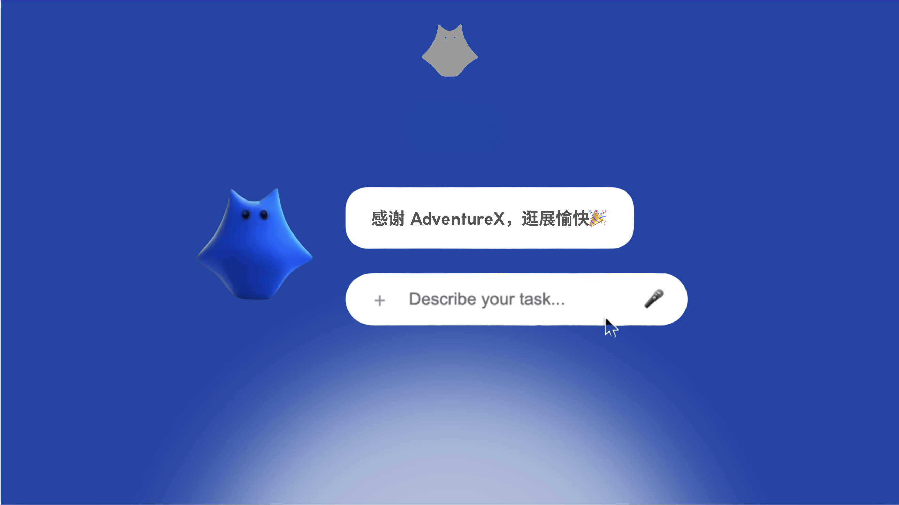
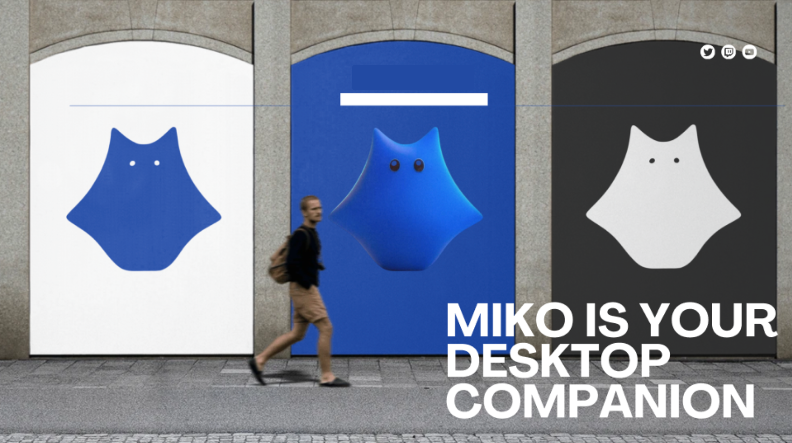

# Miko Desktop Pet
去年 7 月份，我们在 Adventure X  第一次创建了 miko 。
因为在想做什么的原因，项目以很缓慢的状态在构建，今天更新了一个版本

Miko 是常驻桌面的 AI ，以 Claude Agent SDK 形式连接 Claude Code：透明窗口、永久悬浮、随时对话，并通过 Claude Code ，配合 Skills、Plugins、Sub-agents、MCP，可以被重新组合、被重新定义。

## 1. 一些 Aha moment
虽然大部分都是 CC 本身的能力，但是通过桌宠的聊天交互来实现，还是给了我很多不一样的惊喜🎉

1. 处理 Obsidian with Skill/CC

因为miko：永久悬浮+连接了在 CLI Agent CC ，所以我可以在任何地方使用他 Agent 的能力，我不用在我用 Obsidian 的时候切换到 终端，我能在任何应用、界面，只要我想用
为了本地化，我果断把 Heptabase 迁移到了 Obsidian 。

借用 Obsidian 和 notebook LM 的 Skill，我可以让他创建一个 canvas 在 Obsidian

（发现录的视频有一些隐私数据，暂时应该没人看，我下个剪映明天改一下）

2. GUI Agent

最近用来一个 2B 的端侧模型（腾讯开源的 GUI youtu），然后尝试把他接入到了 Claude Code，我发现了很多可能性，对于我自己的 Aha Moment：
前面提到的端侧小模型，接入了 Doubao 的 API 后，他能执行一些有趣的小任务，我把他接在了 CC 里，他会做意图识别，有需要再调用

3. MCP

之前我们已经实现过调用浏览器来搜索，这次我们接了 Chrome MCP ，增加了更多的可能性。

突然发现我们在 AdventureX 计划的很多，可以被 CC 如此完成。在构建完后，我也一直 start 在我的桌面，自己使用，Dogfooding 

很容易想到，miko 如果再有更优雅和容易的管理 Skill、MCP、Sub-Agent、Plugin、各种意图调用的项目...以及更满意的交互和设计，会是一个很有意义的桌面 Agent，也能沉淀一些个人的数据和 AI handson know-how 来到下一次 “Skill“ 下一次 “MCP“

但现在的 UI 和 design system 都太糟糕了。还有最重要的 Dashboard 的功能实现上。Next Step 首先解决这两个。

## 2. Roadmap

- milestone1（Done）：
    1. 永久悬浮桌宠+对话框，连接 Claude Code
    2. 连接 Claude Code，完成初步的 ChatUI 适配 Claude Code
- milestone2（Done）：
    1. Dashboard 面板管理 Skill/Plugin/MCP/API/提示词/连接端口
    2. 对话记忆与管理，/start /new /history /model，真实连接状态
    3. 以子工具的方式整合了腾讯开源的端侧 GUI Agent Tip，只在意图识别为需要鼠标点击的时候调用
    4. 划词监听、文件/窗口索引、窗口截图、@ 搜索联动

- milestone 2：重构 miko 的设计系统/UI/UX；优化 Dashboard GUI 界面配置&下载&创建 Skill、Plugin、API、MCP .... 
- milestone 3：可以开源的项目接入 miko， 在 Dashboard 管理，在意图识别需要的时候调用
- milestone 4：支持用户和 AI 直接创建自己的应用（基于设计规范和调用原则），后端托管在本地，在 dashboard 直接管理，在意图识别需要的时候调用。
- milestone 5：开放社区分享和使用 self-creat 的应用
- milestone 6：更主动化的 Agent 能力，监听窗口。增加语音交互
- milestone 7：优化桌宠实现，包括动画和交互方式，音效，发布一些周边。
- milestone 8：用户可以很简单地设计和创造自己的主视觉和桌面宠物，应用的设计语言也会随之改变
- milestone 9：优化 GUI 工具，增加学习工作 SOP 和工作流再次执行
- milestone 10：浏览器插件
- milestone 11：Agent 沙箱
- milestone 12：训练优化和支持更多端侧模型，供用户选择，尽可能保证数据和隐私安全
- milestone 13：更换 miko Agent 框架为自研 Agent 框架
- milestone 14：和 miko 刻意记录和维护个人数据，，以增加更多的个人 context，增援 AI 的未来。用于更好地分析和优化自己，优化后端的数据存储和知识管理（PKM） 。数据采集+安全的数据存储+安全调用，供前端应用使用，eg:健康和生物设备的数据（血糖、压力检测、血液咖啡因）、24/7 屏幕监控和分析、录制周围环境。可能会有手机端和硬件结合。
 
